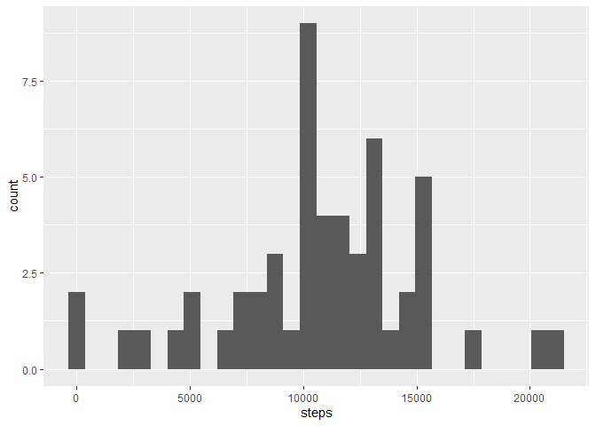

## Loading and preprocessing the data

1. Load the packages and the data


```r
library(ggplot2)
library(dplyr)

data <- read.csv("activity.csv")
```

2. Process/transform the data (if necessary) into a format suitable for your analysis


```r
str(data)
```

```
## 'data.frame':	17568 obs. of  3 variables:
##  $ steps   : int  NA NA NA NA NA NA NA NA NA NA ...
##  $ date    : chr  "2012-10-01" "2012-10-01" "2012-10-01" "2012-10-01" ...
##  $ interval: int  0 5 10 15 20 25 30 35 40 45 ...
```

```r
data$date <-  as.Date(data$date)
```

## What is mean total number of steps taken per day?

1. Make a histogram of the total number of steps taken each day


```r
tot_stps <- data %>% group_by(date) %>% summarise(steps = sum(steps))

ggplot(tot_stps, aes(x = steps)) + geom_histogram()
```

<!-- -->

2. Calculate and report the mean and median total number of steps taken per day


```r
mean(tot_stps$steps, na.rm = TRUE)
```

```
## [1] 10766.19
```

```r
median(tot_stps$steps, na.rm = TRUE)
```

```
## [1] 10765
```

## What is the average daily activity pattern?

1. Make a time series plot of the 5-minute interval (x-axis) and the average number of steps taken, averaged across all days (y-axis)


```r
avg_stps <- data %>% group_by(interval) %>% 
        summarise(steps = mean(steps, na.rm = TRUE))

ggplot(avg_stps , aes(x = interval, y = steps)) + geom_line()
```

<!-- -->

2. Which 5-minute interval, on average across all the days in the dataset, contains the maximum number of steps?


```r
avg_stps$interval[which.max(avg_stps$steps)]
```

```
## [1] 835
```

## Imputing missing values

1. Calculate and report the total number of missing values in the dataset (i.e. the total number of rows with NAs)


```r
sum(is.na(data))
```

```
## [1] 2304
```

2. Devise a strategy for filling in all of the missing values in the dataset. 

**the mean for that 5-minute interval strategy**


```r
med_stps <- data %>% group_by(interval) %>% 
        summarise(steps = mean(steps, na.rm = TRUE))

rep <-  med_stps[rep(seq_len(nrow(med_stps)), length(unique(data$date))), ]
```

3. Create a new dataset that is equal to the original dataset but with the missing data filled in.


```r
n_data <- data
n_data$steps[is.na(data$steps)] <-  rep$steps[is.na(data$steps)]
```

4. Make a histogram of the total number of steps taken each day and Calculate and report the mean and median total number of steps taken per day.


```r
n_tot_stps <- n_data %>% group_by(date) %>% summarise(steps = sum(steps))

ggplot(n_tot_stps, aes(x = steps)) + geom_histogram()
```

<!-- -->

```r
mean(n_tot_stps$steps)
```

```
## [1] 10766.19
```

```r
median(n_tot_stps$steps)
```

```
## [1] 10766.19
```
These values are differ from the estimates from the first part of the assignment.
The impact of imputing missing data on the estimates of the total daily number of steps is in the form the equality of mean and median in the new data.

## Are there differences in activity patterns between weekdays and weekends?

1. Create a new factor variable in the dataset with two levels -- "weekday" and "weekend" indicating whether a given date is a weekday or weekend day.


```r
n_data$day <-  weekdays(n_data$date)
n_data$day[!n_data$day %in% c("Saturday", "Sunday")] <- "weekday"
n_data$day[n_data$day %in% c("Saturday", "Sunday")] <- "weekend"
n_data$day <- as.factor(n_data$day)
```

2. Make a panel plot containing a time series plot (i.e. type = "l") of the 5-minute interval (x-axis) and the average number of steps taken, averaged across all weekday days or weekend days (y-axis). 


```r
avg_stps_d <- n_data %>% group_by(interval, day) %>% 
        summarise(steps = mean(steps))

ggplot(avg_stps_d , aes(x = interval, y = steps)) + geom_line() + 
        facet_grid(day ~ .)
```

<!-- -->

There is some difference.
